# picsel-demo-pipeline
## Resumo
Nesse desafio configuramos dois S3 buckets, um privado e um com acesso público de leitura. Utilizando uma função Lambda baixamos dados (temperatura 2m acima da superfície e precipitação total) de reanálise meteorológica de uma API pública para guardá-los temporariamente em um dos buckets criados. (Observa se, que nesse processo os credenciais para acessar a API são guardados de forma segura dentro do SecretsManager.) Em seguida, utilizamos um Glue Job para processar os dados e extrair as linhas de contorno das temperatura média e precipitação total de cada dia e as salvamos em formato GeoJSON dentro do segundo S3 bucket. Também mostramos como configurar um AWS Glue Crawler para catalogar arquivos nos formatos .csv, .json, etc...

## Introdução
Como o desafio deixou bastante liberdade a respeito dos dados utilizados, decidi usá-lo para mostrar que consigo
implementar os pipelines de dados que constumo implementar em servidores dedicados de forma serverless
também. É o meu primeiro projeto AWS e tem sido uma experiência bastante enriquecedora.

## Resultados
O pipeline implementado consiste em dois buckets, um bucket para input ```picsel-demo-input``` com acesso restrito e um bucket para output ```picsel-demo-output``` com acesso público de leitura. A função Lambda [```download_ERA5.py```](Lambda/download_ERA5.py) que faz o download dos dados meteorológicos históricos tem como argumentos ```year```, ```month``` e ```day```. Uma vez invocada com argumentos válidos, a função baixa os dados meteorlógicos históricos para a data solicitada e salva o arquivo em formato ```netcdf3``` no input bucket. Como a função dever ter um gatilho manual, executei a função três vezes de forma manual para baixar os dados meteorológicso históricos para três dias diferentes (2023-09-01, 2023-09-02 e 2023-09-03). Exemplo:  O arquivo resultante ```era5land_2023-09-01.nc``` para o dia 2023-09-01 tem um tamanho moderado de 2,8 MB. 

Vale ressaltar que foi necessário adicionar um layer contendo a biblioteca ```cdsapi``` que simplifica o processo de fazer a requisição à API da CDS. Para isso, montei o arquivo [```cdsapi_layer.zip```](Lambda/cdsapi_layer.zip).

Uma vez que populamos o bucket ```picsel-demo-input``` com os arquivos contendo os dados meteorólogicos históricos em formato ```netcdf3```, podemos processá-los. Escolhi utilizar um job escrito em Python 3.9 (a runtime mais recente disponível no AWS Glue) para calcular as linhas de contorno das temperatura média e precipitação total de cada dia, plotá-las com ```matplotlib.pyplot``` e salvá-las em formato ```GeoJSON``` no bucket ```picsel-demo-output```. A transformação das linhas de contorno em formato ```GeoJSON``` nos permite visualizá-las com ferramentas web, como por exemplo ```Leaflet``` ou ```OpenLayers```. Foi necessário disponibilizar ao job algumas bibliotecas como ```geopandas```, ```shapely``` e ```geojson``` de forma manual. O arquivo wheel pode ser encontrado [aqui](Glue/geojsoncontour-0.1-py3-none-any.whl). 

Confira os resultados abaixo.
<table width="100%">
  <tbody>
  <tr>
    <td>Temperatura média (em °C) 2023-09-01:</td>
    <td>Precipitação total (em mm) 2023-09-01:</td>
  </tr>
  <tr>
    <td width="50%"></td>
    <td width="50%"></td>
  </tr>
  <tr>
    <td>Temperatura média (em °C) 2023-09-02:</td>
    <td>Precipitação total (em mm) 2023-09-02:</td>
  </tr>
  <tr>
    <td width="50%"></td>
    <td width="50%"></td>
  </tr>
  <tr>
    <td>Temperatura média (em °C) 2023-09-03:</td>
    <td>Precipitação total (em mm) 2023-09-03:</td>
  </tr>
  <tr>
    <td width="50%"></td>
    <td width="50%"></td>
  </tr>
</table>

## Documentação: Parte 1
A configuração da função Lambda foi bem direta. Escolhi como runtime a versão estável mais recente da Python, a Python 3.11, a qual também utilizo no meu computador pessoal. Pensei bastante em como demonstrar minha capacidade de escrever uma função Lambda e optei por implementar uma função que faz uma requisição a uma API e, em seguida, baixa os dados requeridos para o bucket a ser criado. Para isso, a função lambda precisa de permissões de escrever no bucket em questão.
<table width="100%">
  <tbody>
  <tr>
    <td>Configuramos o papel para a função Lambda:</td>
    <td>A função Lambda tem acesso completo ao serviço S3:</td>
  </tr>
  <tr>
    <td width="50%">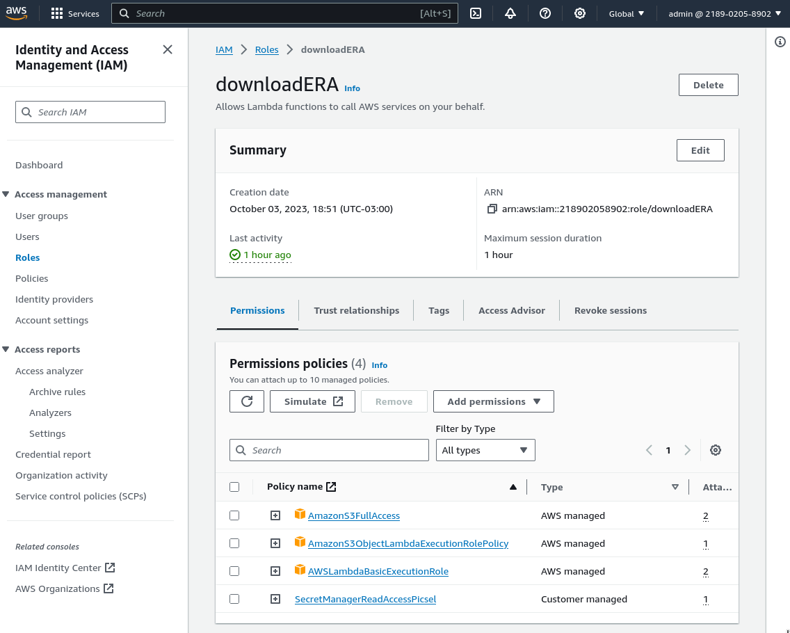</td>
    <td width="50%">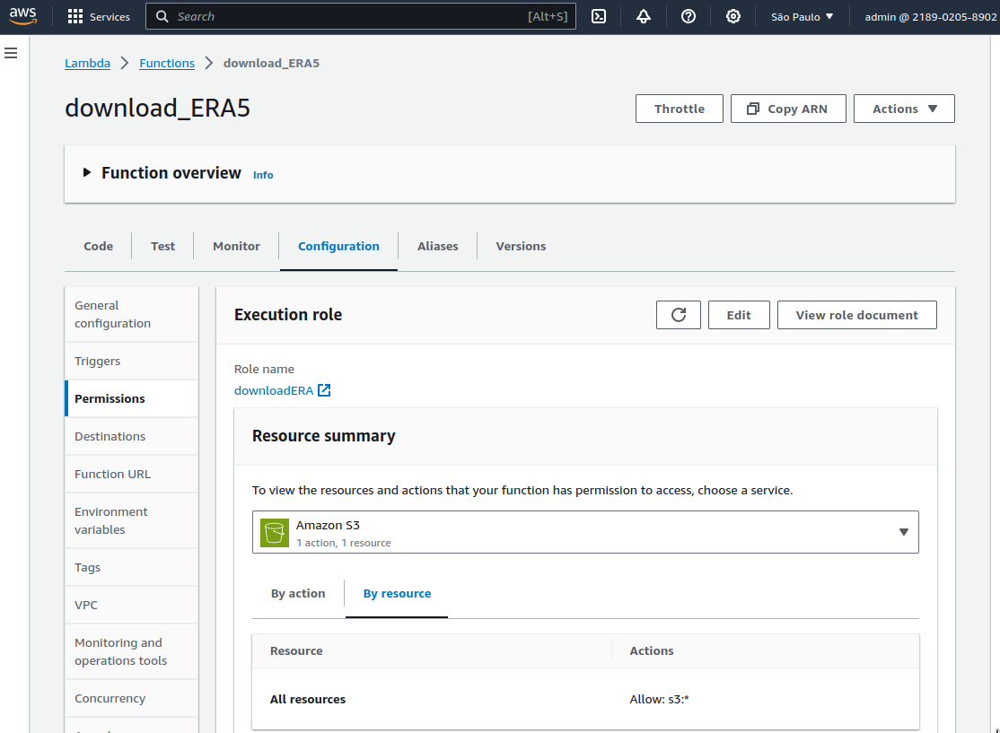</td>
  </tr>
  <tr>
    <td>A função Lambda tem permissão de escrever log:</td>
    <td>A função Lambda precisa de acesso ao SecretsManager para descriptografar os credenciais secretos para fazer uma requisição à API. Observe que apenos o segredo relevante é compartilhado com a função: (Criamos a política personalizada ``SecretsManagerReadAccessPicsel'' para isso.)</td>
  </tr>
  <tr>
    <td width="50%">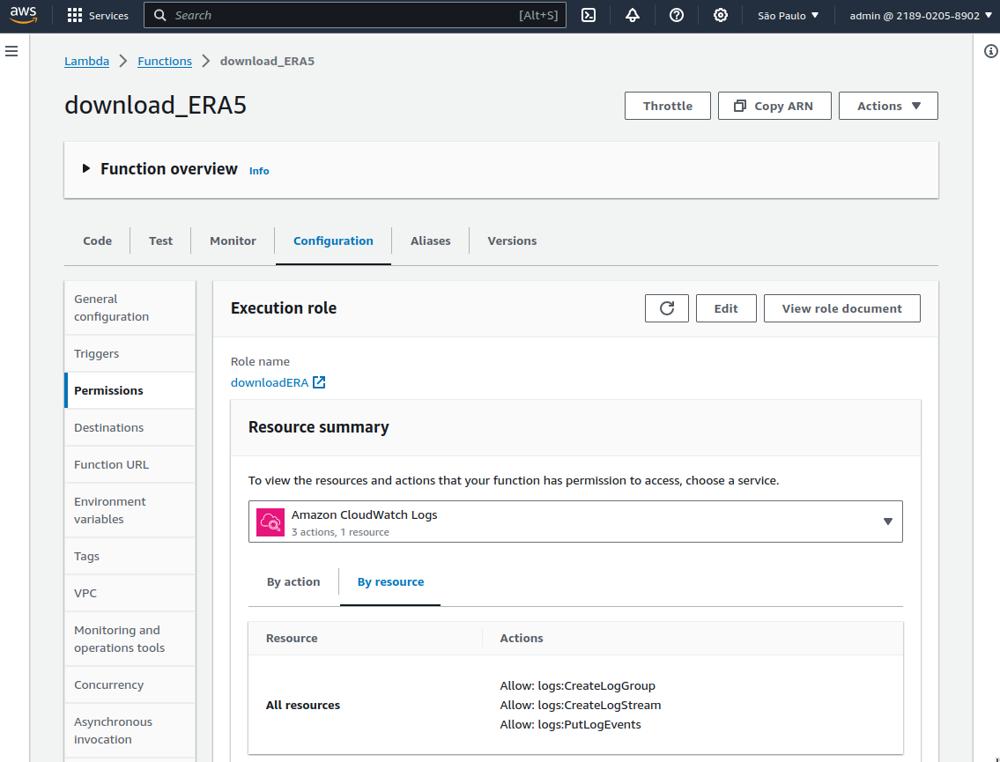</td>
    <td width="50%">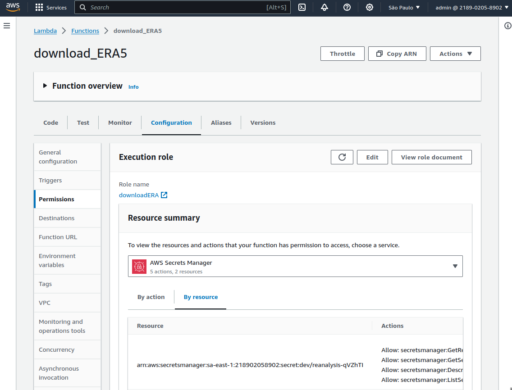</td>
  </tr>
</table>

### Checklist
- [x] Crie uma função no AWS Lambda: **[```download_ERA5.py```](Lambda/download_ERA5.py)**
- [x] Escolha uma runtime, como Python 3.x. **Runtime escolhida: 3.11**
- [x] A função deve ter um gatilho de execução manual. **Executamos a função de forma manual, com argumentos escolhidos por nós.**
- [x] Atribua a função a um papel com permissões adequadas para interagir com o Amazon S3 e o AWS Glue, se necessário. **Papel criado: "downloadERA"**
- [x] Configure um bucket no Amazon S3: **Bucket: "picsel-demo-input"**
- [x] Nome do bucket: "seu-nome-bucket". **Para adequar o nome à função do projeto, mudei o nome do bucket para "picsel-demo-input"**
- [x] Configure permissões de acesso para que o bucket seja público (somente leitura). **Bucket público: "picsel-demo-output". Confira os plots na seção [Resultados](#resultados)**

## Documentação: Parte 2

## Documentação: Parte 3
### CloudWatch
Utilizei esse serviço para rastrear fontes de erros no momento da implementação do pipeline e depois para monitorar o funcionamento correto do pipeline. Por exemplo, em um primeiro momento não estava claro como incluir bibliotecas de terceiros na função Lambda e no job do Glue. Logar os erros foi essencial para rastrear o que deu errado. Dessa forma consegui resolver os problemas que surgiram de forma célere.
<table width="100%">
  <tbody>
  <tr>
    <td>Página inicial do serviço CloudWatch com alguns indicadores:</td>
    <td>Temos grupos de log para a função Lambda, o job do Glue e o crawler do Glue:</td>
  </tr>
  <tr>
    <td width="50%">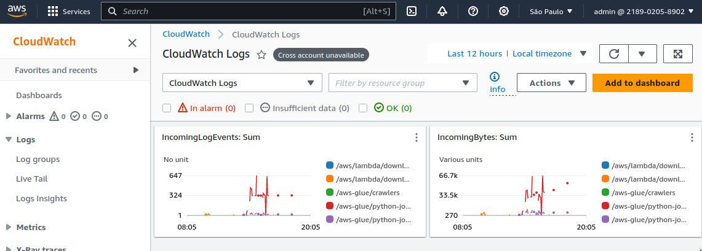</td>
    <td width="50%">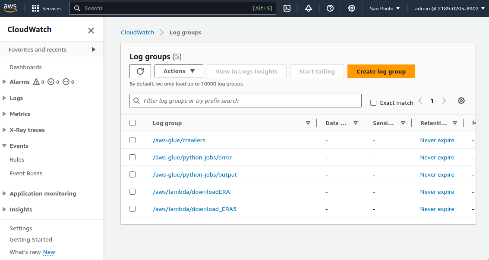</td>
  </tr>
  <tr>
    <td>O painel da função Lambda mostra alguma atividade recente:</td>
    <td>Podemos acessar a história de execuções da função Lambda:</td>
  </tr>
  <tr>
    <td width="50%">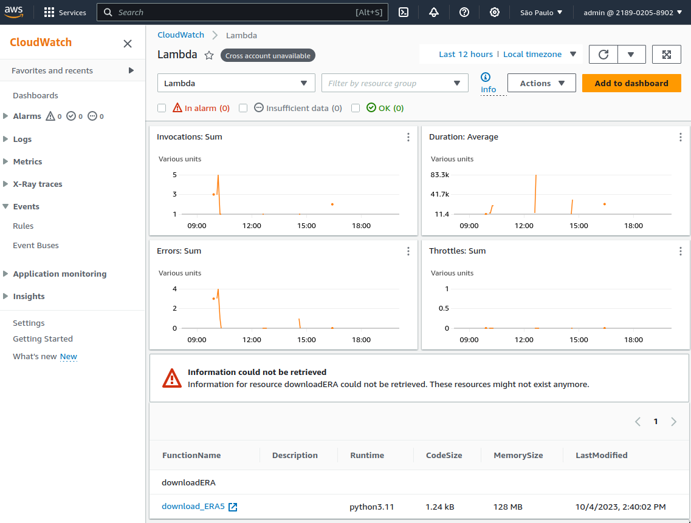</td>
    <td width="50%">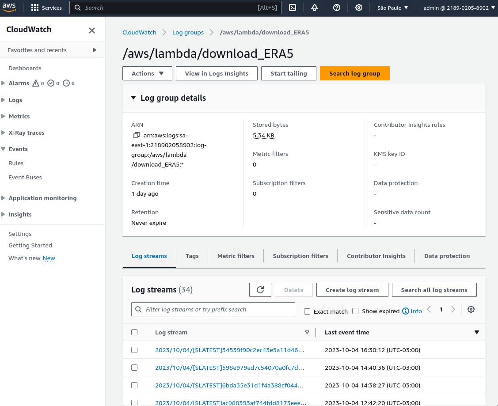</td>
  </tr>
  <tr>
    <td>Cada execução do job do Glue adiciona um novo arquivo com os outputs:</td>
    <td>E outro arquivo com os erros:</td>
  </tr>
  <tr>
    <td width="50%">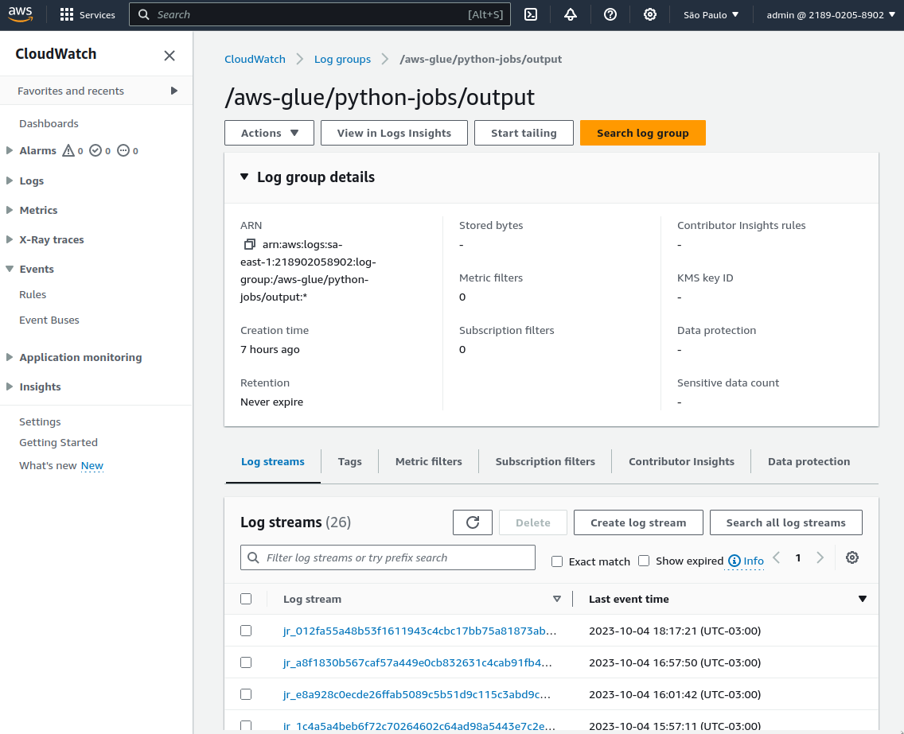</td>
    <td width="50%">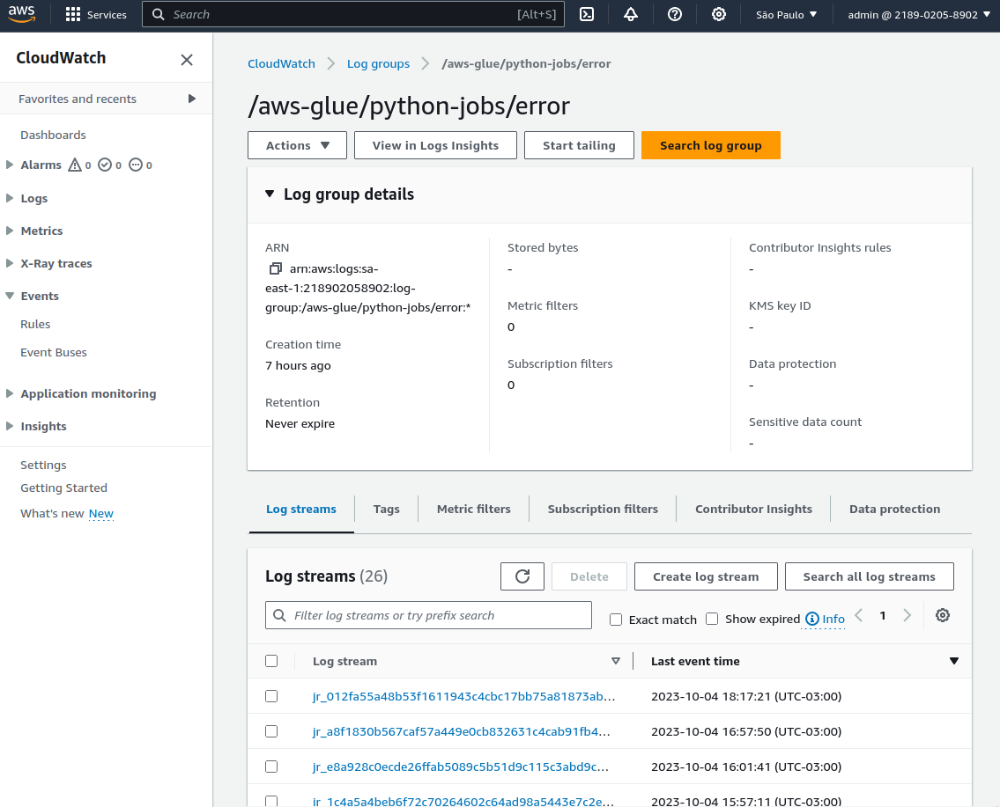</td>
  </tr>
</table>

### CloudTrail
<table width="100%">
  <tbody>
  <tr>
    <td>Visitamos a página do serviço CloudTrail:</td>
    <td>Criamos um ``trail'' básico:</td>
  </tr>
  <tr>
    <td width="50%">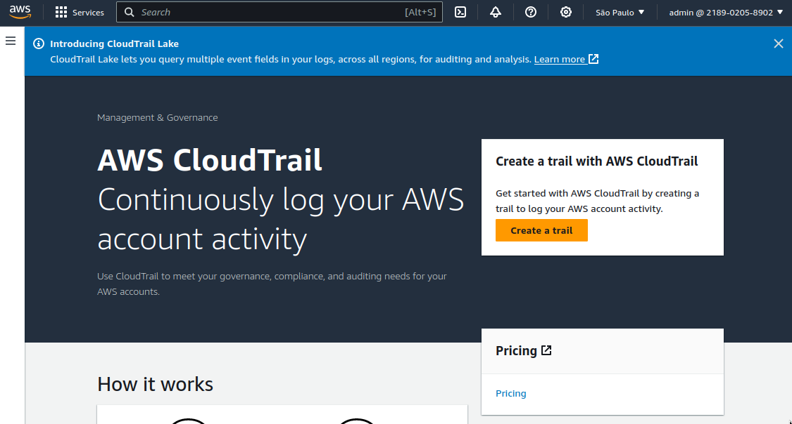</td>
    <td width="50%">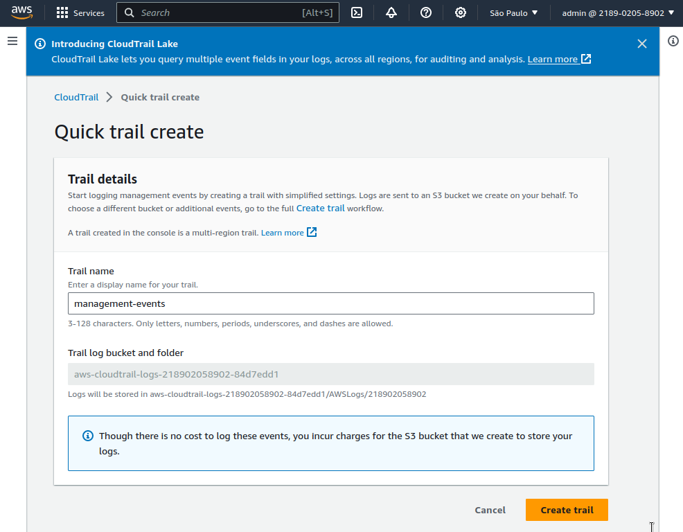</td>
  </tr>
  <tr>
    <td>O painel mostra os incidadores e parte da história de eventos da nossa conta AWS:</td>
    <td>Podemos acessar a história de eventos associados às nossa conta em mais detalhe:</td>
  </tr>
  <tr>
    <td width="50%">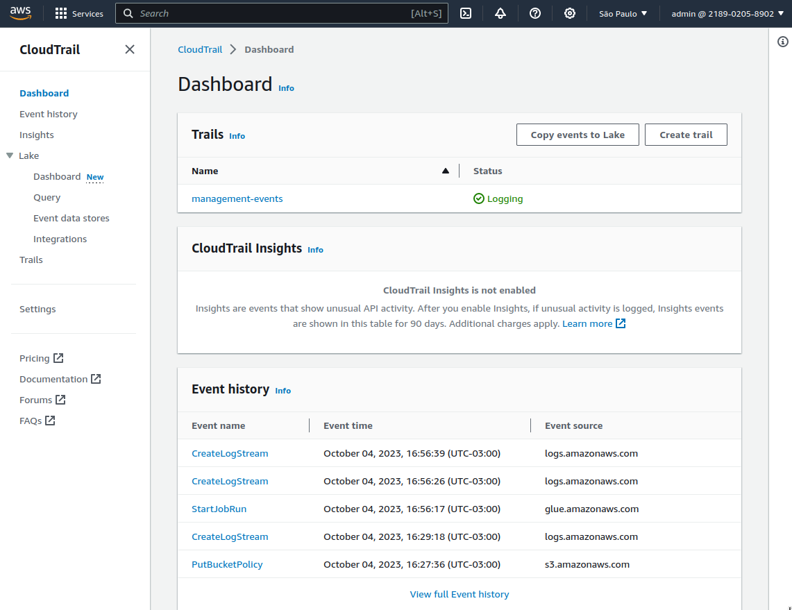</td>
    <td width="50%">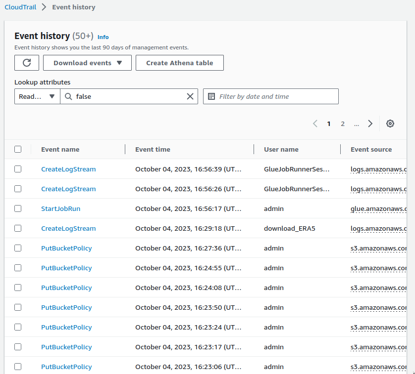</td>
  </tr>
</table>

### Checklist
- [x] Configure o Amazon CloudWatch para monitorar:
- [x] Execuções e erros da sua função no AWS Lambda.
- [x] Ocorrência de erros nos jobs do AWS Glue.
- [x] Configure o Amazon CloudTrail:
- [x] Ative o CloudTrail para monitorar eventos na sua conta AWS.
